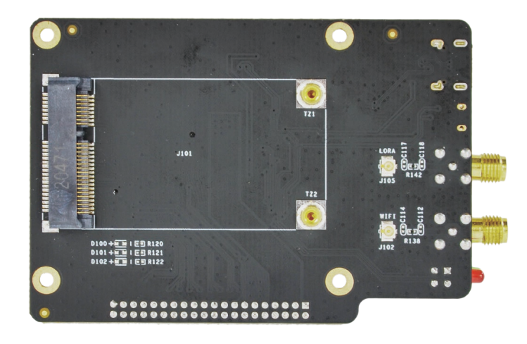
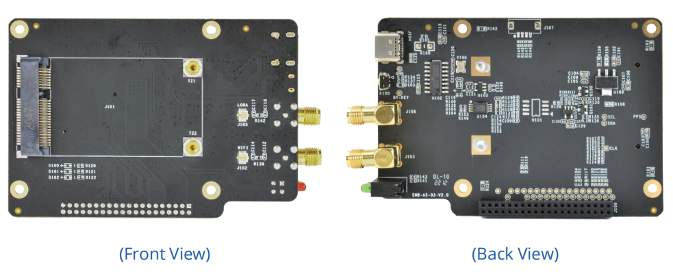
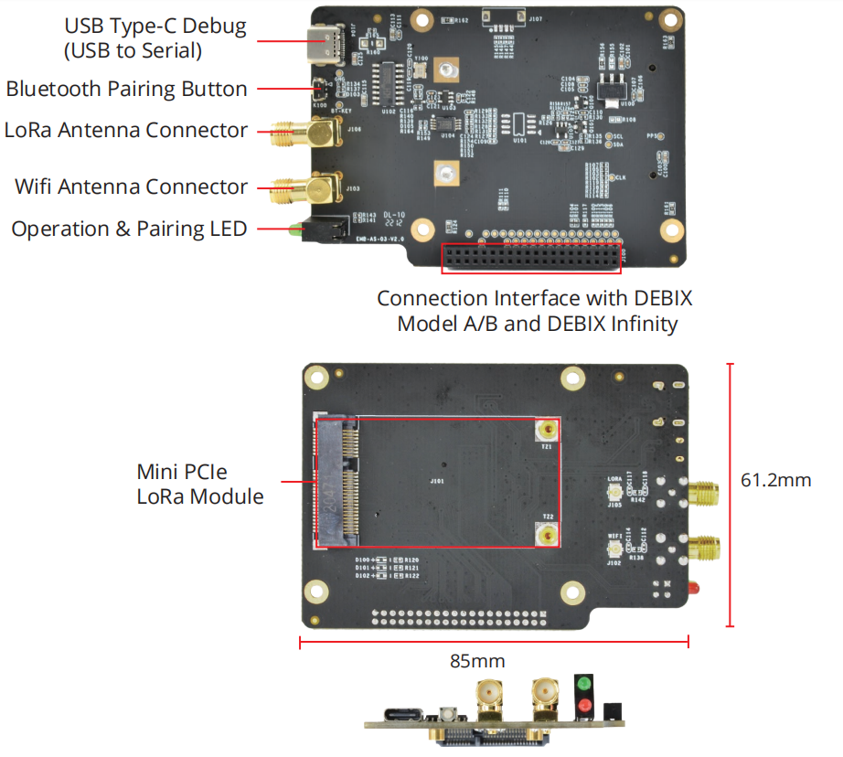

# DEBIX LoRa Board
 

## Overview
DEBIX LoRa Board fits DEBIX Model A/B, DEBIX Infinity and DEBIX R3576-01, and provides a Mini PCIe interface for LoRa Module. LoRa enables long-range transmissions with low power con-sumption. In addition to a LoRa Antenna Connector
, it also has a Wifi Antenna Connector and Bluetooth Pairing Button.

## Compatibility:
Compatible with DEBIX Model A, DEBIX Model B, DEBIX Infinity, DEBIX R3576-01

## Specification
|   I/O Interfaces   |      |
|--------------------|------|
| USB          | 1 × USB Type-C Debug (USB to Serial) |
| Mini PCIe    | 1 × Mini PCIe (LoRa Module) |
| Buttons      | 1 × Bluetooth Pairing Button |
| LED          | 1 × Operation Indicator, 1 × Pairing Indicator |
| External Antenna | 1 × LoRa Antenna Connector, 1 × WiFi Antenna Connector |
| EEPROM       | 1 × 2Kbit EEPROM |
| Clipper Chip | 1 × Secure Element, eg. ATECC608 |
| **Power Supply**|         |
| Power Input  | DC 5V/1A |
| **Mechanical** |       |
| Size (L × W) | 85.0mm × 61.2mm (±0.5mm) |
| Net Weight   | 28g (±0.5g) |
| Gross Weight | 54g (±0.5g) |

 

## Product Compliance and Safety
CE (CE-EMC) | FCC | RoHS | UKCA | C-Tick  
*For more information, please visit [our offical website.](https://debix.io/product/debix-lora-board/)*

## I/O Interfaces:

## Connection with DEBIX Model A/B:

## Safety Instructions and Warnings:
**General:**
- Avoid exposure to water, moisture and conductive surfaces while operating.
- Handle with care to avoid mechanical or electrical damage to the circuit board and connectors.
- Only handle the board by the edges when powered on to minimize the risk of electrostatic discharge damage.

**Environment:**
- Operate in a well-ventilated environment, even if using a case.
- Place on a stable, flat, non-conductive surface and avoid contact with conductive items.

**Connections:**
- Use peripherals that comply with relevant standards for the country of use and ensure proper insulation and operation.

**Additional notes:**
- This summary is not exhaustive, please refer to the full User Manual for details.
- If you are unsure about any aspect of safety or operation, consult a qualified
professional.

## Contact Us
- **Headquarters**: DEBIX Technology Inc., 8345 Gold River Ct., Las Vegas, NV 89113, USA  
- **Factory**: 5-6/F., East Zone, Shunheda A2 Building, Liqxiandong Industrial Park, XiLi, Nanshan Dist., Shenzhen, China  
- **Email**: info@debix.io  
- **Website**: [www.debix.io](https://www.debix.io)  
- **Community**: [Discord](https://discord.com/invite/adaHHaDkH2)